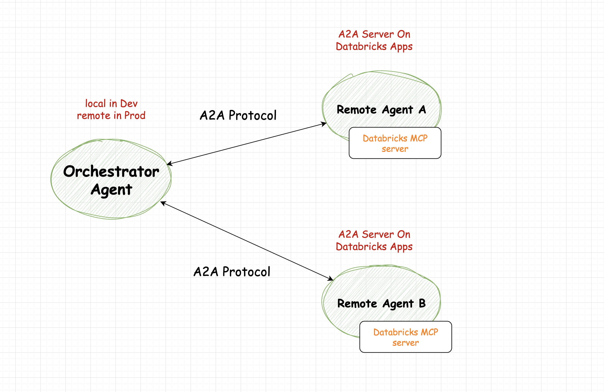
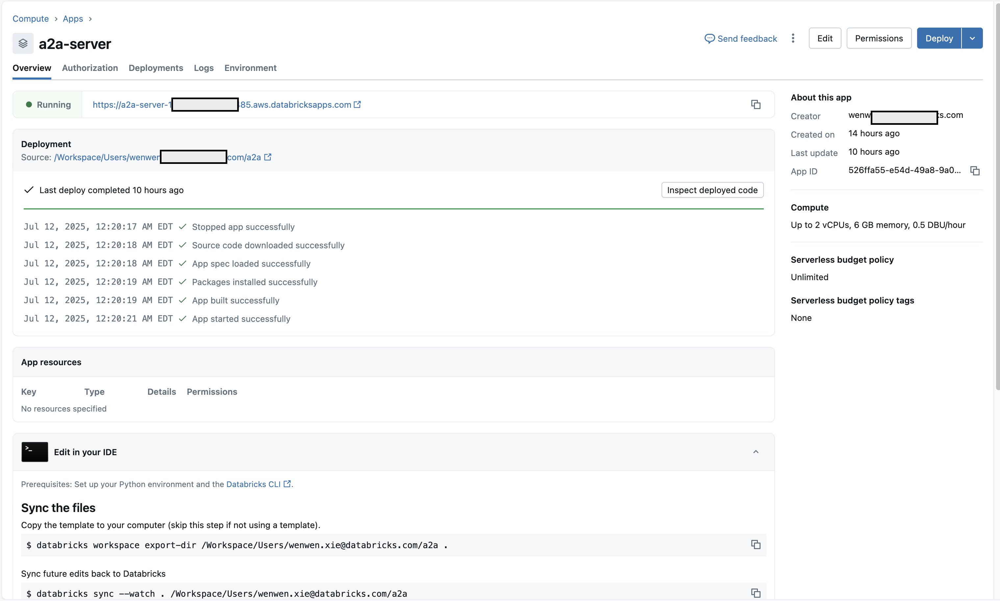

# Connecting Databricks Managed MCP Server and A2A (Agent2Agent Communication)

## Overview

This project demonstrates how the Model Context Protocol (MCP) and the Agent2Agent (A2A) protocol work together to enable a dynamic, extensible agent ecosystem. Combining A2A and MCP protocols enables the development of interoperable AI systems. In such architectures:

- **Agent Discovery and Collaboration**: A2A allows agents to discover each other and collaborate on tasks.
- **Tool and Data Access**: MCP enables agents to access necessary tools and data sources to fulfill their tasks.


## Key Concepts

- **MCP (Model Context Protocol)**: Acts as a centralized registry for all discoverable agents, tools, and resources. Any agent or client can query the MCP server to find available resources and retrieve their metadata (Agent Cards).
- **A2A (Agent2Agent Protocol)**: Defines the standard for how agents communicate with each other at runtime. Once an agent discovers another agent (like Genie) via MCP, it uses A2A to send tasks, receive results, and coordinate workflows.

## How Databricks Managed MCP server and A2A Work Together

**Architecture Illustration:**

- **Orchestrator Agent**
  - Central coordinator.
  - Discovers and manages remote agents using the A2A (Agent2Agent) protocol.
  - Runs locally in development, remotely in production.

- **Remote Agents (A, B, ...)**
  - Each remote agent runs as an A2A server, typically on Databricks Apps.
  - Each agent is accessible via the A2A protocol.
  - Each agent has access to a Databricks MCP server, which they use for specific tool calls or data processing.

**Technical Flow:**
- The orchestrator agent uses the A2A protocol to discover and communicate with each remote agent.
- Remote agents expose endpoints via the A2A protocol.
- Each remote agent can make calls to its own Databricks MCP server to execute workloads or fetch data.



- The A2A protocol enables both discovery and secure communication between the orchestrator agent and multiple remote agents. Each remote agent, running as an A2A server on Databricks, has access to its local Databricks MCP server for executing remote tool calls. 

## How To Use the Code

- `server.py`: Exposes the Genie Agent by creating an `AgentCard` in local default '/.well-known/agent.json' public agent path and make it accessible via A2A client request.
- `agent_executor.py`: Connects the Genie Agent logic to the Databricks managed MCP server, so requests routed to the Genie Agent endpoint are handled by Databricks managed MCP server for genie space.
- `client.py`: Example of how an agent or client can discover the Genie Agent via public agent card and interact with it using A2A.

## Deploy A2A server on Databricks Apps
   Deploy below four code files on Databricks Apps:
   - `server.py`
   - `agent_executor.py`
   - `app.yaml`
   - `requirements.txt`
   For how to create a Databricks apps in detail, see [documentation](https://docs.databricks.com/aws/en/dev-tools/databricks-apps/) here.



## Running the client.py code either in local or remote apps.

When you run it in local IDE, make sure to set up the Databricks Oauth u2m profile through Databricks CLI. See [documentation](https://docs.databricks.com/aws/en/dev-tools/cli/authentication) here

`databricks auth login --host <workspace-url>`

`config = Config(profile="Your profile name")`

Running the code and you will get back a response, after executing the Databricks genie MCP tool on a A2A server.
```
$ python3 client.py
```
```
capabilities=AgentCapabilities(pushNotifications=None, stateTransitionHistory=None, streaming=True) defaultInputModes=['text'] defaultOutputModes=['text'] description='genie agent' documentationUrl=None name='genie-agent' provider=None security=None securitySchemes=None skills=[AgentSkill(description='returns genie information', examples=['List top 3 distribution centers.'], id='genie', inputModes=None, name='Returns genie information', outputModes=None, tags=['genie'])] supportsAuthenticatedExtendedCard=False url='https://a2a-server-your-url.aws.databricksapps.com/api/a2a' version='1.0.0'
{'id': '49cecb18-95cb-41ea-a9ad-23ca5de6b195', 'jsonrpc': '2.0', 'result': {'kind': 'message', 'messageId': '248ec442-267b-4026-9f77-2c4fd3bd462e', 'parts': [{'kind': 'text', 'text': 'Based on the data analysis, here are the top 3 distribution centers by total demand:\n\n1. Distribution Center 4: 19,350 units\n2. Distribution Center 2: 18,930 units\n3. Distribution Center 3: 18,245 units\n\nThese distribution centers handle the highest volume of product demand in the network, making them critical nodes in the supply chain infrastructure.\n'}], 'role': 'agent'}}
```

