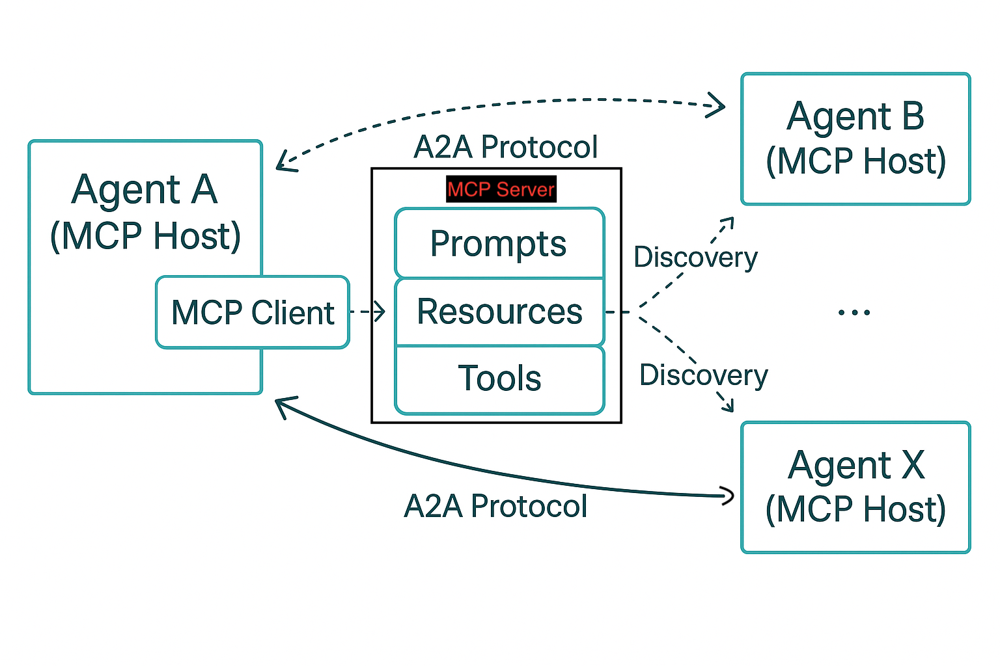

# Connecting MCP (Discovery) and A2A (Agent-to-Agent Communication)

## Overview

This project demonstrates how the Model Context Protocol (MCP) and the Agent-to-Agent (A2A) protocol work together to enable a dynamic, extensible agent ecosystem. The Genie Agent is registered as a discoverable resource on the MCP server. Any agent (not just end users) can use MCP to discover the Genie Agent, then use the A2A protocol to interact with it in a standardized way.

## Key Concepts

- **MCP (Model Context Protocol)**: Acts as a centralized registry for all discoverable agents, tools, and resources. Any agent or client can query the MCP server to find available resources and retrieve their metadata (Agent Cards).
- **A2A (Agent-to-Agent Protocol)**: Defines the standard for how agents communicate with each other at runtime. Once an agent discovers another agent (like Genie) via MCP, it uses A2A to send tasks, receive results, and coordinate workflows.

## How MCP and A2A Work Together

1. **Discovery (MCP)**:  
   Any agent (e.g., a planner, orchestrator, or another tool agent) queries the MCP server to discover available agents/tools, such as the Genie Agent.
2. **Retrieval (MCP)**:  
   The agent retrieves the Genie Agent's card, which describes its capabilities and provides its A2A endpoint.
3. **Interaction (A2A)**:  
   The agent then uses the A2A protocol to connect to the Genie Agent's endpoint, send tasks, and receive results—enabling seamless, standardized agent-to-agent workflows.

## Example Flow



- **MCP**: Central registry for all agents/tools.
- **A2A**: Standard protocol for agent-to-agent communication after discovery.

## Why This Matters

- **Separation of Concerns**: MCP handles discovery and registry; A2A handles secure, real-time agent communication.
- **Extensibility**: Any number of agents can be added to the MCP registry and immediately become discoverable and accessible to other agents via A2A.
- **Standardization**: Both protocols build on open standards, making integration and interoperability straightforward.

## How It Works in Code

- `server.py`: Registers the Genie Agent with the MCP server by creating an `AgentCard` and exposing it as a resource.
- `agent_executor.py`: Connects the Genie Agent logic to the MCP server, so requests routed to the Genie Agent endpoint are handled by the Genie Room logic.
- `genie_room.py`: Implements the Genie Agent's business logic and API interactions.
- `client.py`: Example of how an agent or client can discover the Genie Agent via MCP and interact with it using A2A.

## Running the System

1. **Start the MCP Server** (serves the Genie Agent card as a resource):
   ```sh
   uv venv  # if not already done
   source .venv/bin/activate
   uv run server.py
   ```

2. **Run the Example Client or Another Agent** to discover and interact with the Genie Agent using A2A:
   ```sh
   python client.py
   ```

## Summary

This architecture enables a flexible, scalable agent ecosystem where any agent can discover and interact with any other agent or tool registered on the MCP server, using the A2A protocol for standardized communication.
